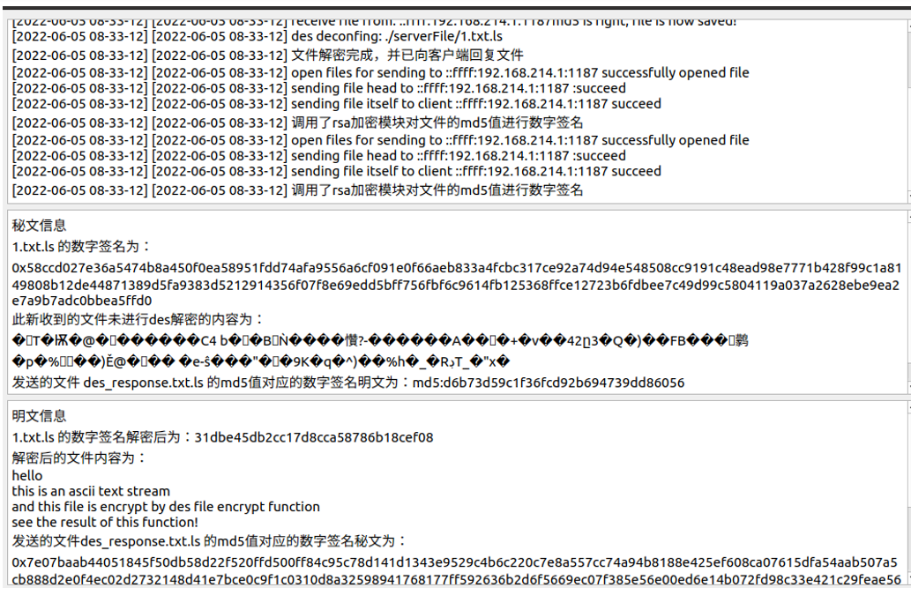

# netdisk_transport
这是网盘程序的传输底层支撑程序，本网盘程序能够实现Kerberos认证的全过程。
## 本网盘的底层逻辑如下：
1. 本网盘的服务器端是多线程服务器，且在其中通过信号与槽的方式实现了服务于客户端的子线程中的传输状态在主线程窗口中的显示。如图所示：
2. 传输的协议是TCP协议，网盘的最小传输单位是文件（认证文件为文本文件，其他正式传输的文件为其对应的那个文件）
3. 无论是认证文件还是已登录的用户正式上传、下载的文件，在本底层程序的视角内都是同样的文件。认证的具体过程由上层实现
4. 本网盘还实现了基于RSA加密算法的数字签名过程，数字签名的传输主要是在传输文件结束之后，发送方直接通过socket写入此数字签名供接收方校验
5. 所有的文件传输均需要使用DES加密来对文件本身进行加密，以确保文件的安全性
## 本程序中值得改正的点
1. 传输单位可以从文件更改为JSON文件，真实传输的文件可以是JSON文件中的某一个字段，此字段为定长字段；
2. 数字签名也可以是文件中一个字段；
经过上面两点的改进，可以保证文件传输和认证的统一；也能够保证传输过程中对文件的校验（而不是传输完成后整体校验）

